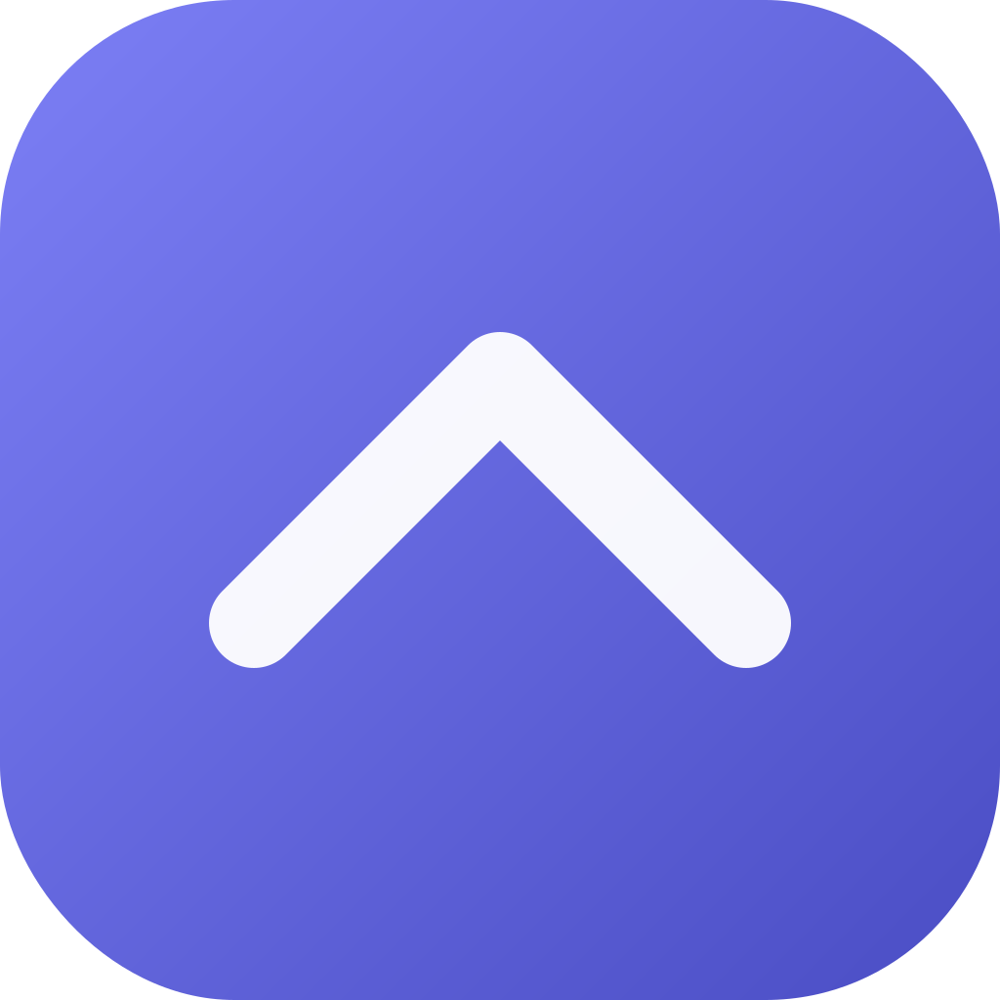
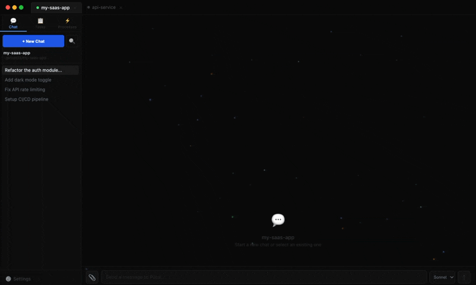

<p align="center">
  
</p>

<h1 align="center">Pilos Agents</h1>

<p align="center">
  <strong>Turn AI conversations into automated workflows — a native desktop app for Claude Code with multi-agent teams, visual workflow builder, and one-click MCP integrations.</strong>
</p>

<p align="center">
  <a href="https://github.com/pilos-ai/agents/releases"></a>
  <a href="https://github.com/pilos-ai/agents/blob/main/LICENSE"></a>
  <a href="https://github.com/pilos-ai/agents/stargazers"></a>
  <a href="https://pilos.net"></a>
  <a href="https://discord.gg/Qzs6MQkUY8"></a>
  <a href="https://x.com/pilosdotnet"></a>
</p>

<p align="center"></p>

---

## What is Pilos?

Pilos is a native desktop app that sits on top of Claude Code. Instead of typing the same prompts over and over in a terminal, you chat once — then save, schedule, and automate that workflow for next time.

- **Chat → Workflow** — describe a task in plain English, convert the conversation into a reusable workflow
- **Schedule it** — run workflows on a schedule (daily standups, weekly reports, nightly code reviews)
- **Multi-agent teams** — PM, Architect, Developer, Designer, and Product agents collaborate with distinct perspectives
- **One-click MCP tools** — connect GitHub, Jira, Supabase, Sentry, and more without editing JSON configs
- **Everything persists** — conversations, memory, and context survive restarts

No lock-in. Claude Code CLI does all the AI work. Pilos is the visual layer on top.

## Download

<table>
  <tr>
    <td align="center"><b>macOS</b></td>
    <td align="center"><b>Windows</b></td>
    <td align="center"><b>Linux</b></td>
  </tr>
  <tr>
    <td align="center"><a href="https://github.com/pilos-ai/agents/releases/latest">Download .dmg</a></td>
    <td align="center"><a href="https://github.com/pilos-ai/agents/releases/latest">Download .exe</a></td>
    <td align="center"><a href="https://github.com/pilos-ai/agents/releases/latest">Download .AppImage</a></td>
  </tr>
</table>

> **Prerequisite:** [Claude Code CLI](https://docs.anthropic.com/en/docs/claude-code) — `npm i -g @anthropic-ai/claude-code`

## Features

### Free (MIT)

- **Workflow Builder** — convert any agent conversation into a reusable, shareable workflow
- **Multi-Agent Teams** — 5 built-in roles (PM, Architect, Developer, Designer, Product) that collaborate on tasks
- **Multi-Project Tabs** — work on multiple projects simultaneously with isolated conversations and context
- **Integrated Terminal** — full terminal emulator (xterm.js) embedded alongside agent output
- **MCP Integrations** — built-in servers for GitHub, Supabase, and Filesystem — one-click setup, no JSON editing
- **Persistent Memory** — SQLite-backed project memory that carries across sessions and restarts
- **Permission Modes** — auto-approve, ask-before-running, or read-only — you control what agents can do
- **Auto Updates** — automatic update checks with in-app install

### Pro

- **Scheduled Automation** — run workflows on a cron schedule (daily, weekly, on push, etc.)
- **Browser MCP** — let Claude see and interact with your browser via a Chrome extension
- **Computer Use** — macOS screen automation (screenshot, click, type) for visual tasks
- **Jira Integration** — read and update Jira issues directly from the agent conversation
- **Sentry Integration** — query errors, issues, and AI-powered root cause analysis
- **Premium MCP Templates** — one-click setup for Notion, Linear, Slack, and more

See [pilos.net/pricing](https://pilos.net/pricing) for plans.

## Build from Source

```bash
git clone https://github.com/pilos-ai/agents.git
cd agents
npm install
npm run dev
```

**Requirements:** Node.js 18+, Claude Code CLI authenticated

```bash
npm run build          # Production build
npm run dist:mac       # Package for macOS (.dmg)
npm run dist:win       # Package for Windows (.exe)
npm run dist:linux     # Package for Linux (.AppImage)
```

## Tech Stack

| Electron | React 19 | TypeScript | Vite | Zustand | Tailwind CSS | xterm.js | better-sqlite3 |
|----------|----------|------------|------|---------|--------------|----------|-----------------|

## Project Structure

```
electron/           Electron main process
  core/             Claude process management, database, terminal
  services/         Settings store, MCP config, CLI detection
src/                React renderer
  components/       UI components
  store/            Zustand state management
  hooks/            Custom React hooks
packages/           Optional feature packages (PM, Pro)
resources/          App icons and assets
```

## Contributing

Contributions are welcome.

1. Fork the repo
2. Create a feature branch (`git checkout -b my-feature`)
3. Commit your changes
4. Open a Pull Request

See [open issues](https://github.com/pilos-ai/agents/issues) for ideas on where to start.

## Community

- [Website](https://pilos.net) — download, docs, and pricing
- [GitHub Issues](https://github.com/pilos-ai/agents/issues) — bug reports and feature requests
- [Discord](https://discord.gg/Qzs6MQkUY8) — chat with the team
- [X / Twitter](https://x.com/pilosdotnet) — updates and announcements

## License

MIT — see [LICENSE](LICENSE) for details. Pro extensions are [BUSL-1.1](https://github.com/pilos-ai/agents/blob/main/packages/pro/LICENSE).
